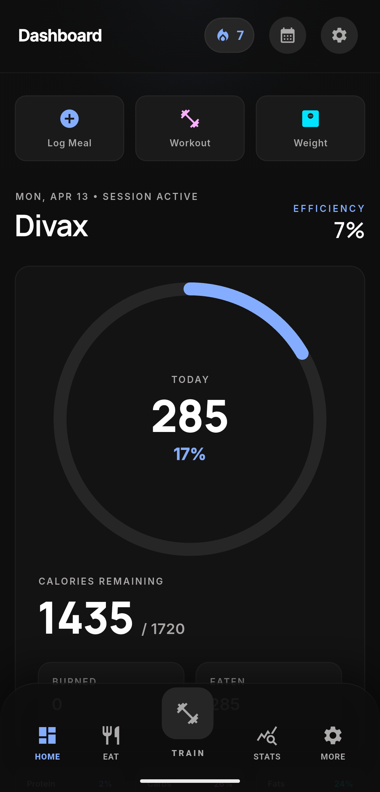
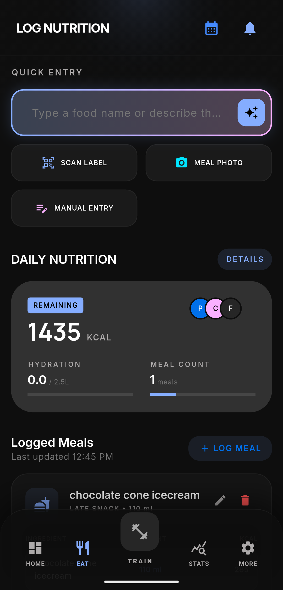
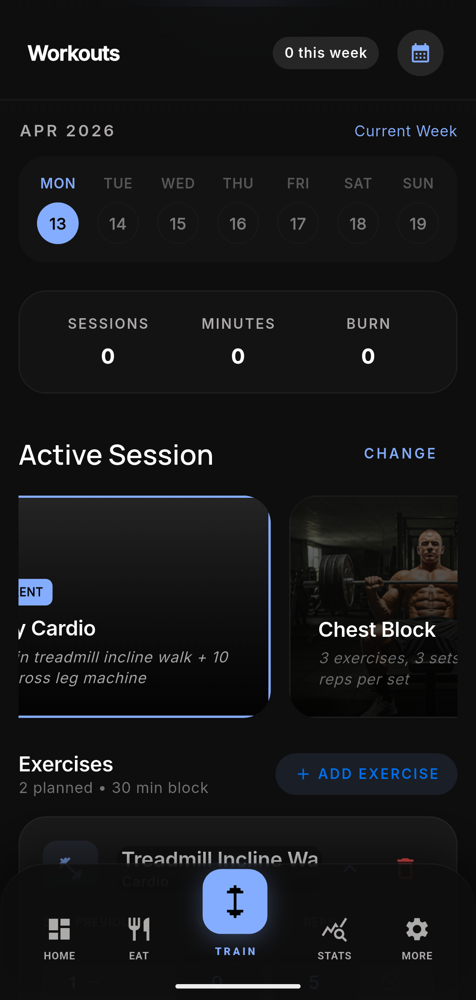
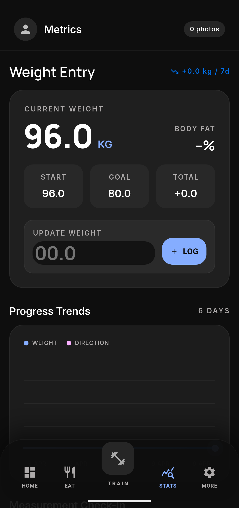
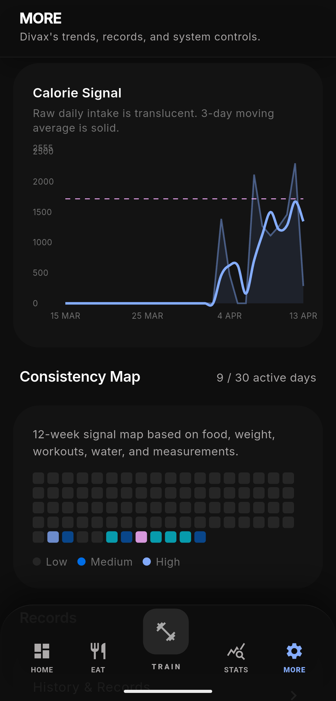

# food_tracker

Local-first fitness app for **nutrition**, **workouts**, and **body metrics**. Data stays on your device (SQLite via [Drift](https://drift.simonbinder.eu/)); optional AI coach features use your configured runtime.

## Screenshots

Source assets are **1080px** wide; below they are shown at **300px** width with **height** set per file so aspect ratio matches each PNG.

**Dashboard** — overview and quick actions  

<p align="center"></p>

**Food log** — daily intake  

<p align="center"></p>

**Workouts** — sessions and presets  

<p align="center"></p>

**Stats & analytics** — trends and charts  

<p align="center"></p>

**More** — extra tools and settings  

<p align="center"></p>

To resize later, scale **width** and **height** together (keep `height ≈ width × (native_height ÷ 1080)`).

## Features

- **Food log** and **diary** for daily intake  
- **Workouts** with presets and history  
- **Metrics** and **analytics** (charts)  
- **Dashboard**, **history**, and **settings**  
- **Onboarding** for first-time setup  
- **Notifications**, **CSV** import/export, **share**  
- **Photos** where the flow uses the device gallery or camera  

## Tech stack

- Flutter · Dart `^3.11.4`  
- [Riverpod](https://riverpod.dev/) for app state  
- [Drift](https://drift.simonbinder.eu/) + SQLite for persistence  
- [fl_chart](https://github.com/imaNNeo/fl_chart) for charts  

## Prerequisites

- [Flutter](https://docs.flutter.dev/get-started/install) (stable), with `flutter doctor` clean for your targets  
- For **Android** builds: a JDK (e.g. 17 or 21) and `ANDROID_HOME` set as usual  

## Run (development)

```bash
flutter pub get
flutter run
```

**Linux desktop** (if you use Snap Flutter and hit Java/tooling issues, set Java explicitly—for example):

```bash
export JAVA_HOME=/usr/lib/jvm/java-21-openjdk-amd64
rm -f ~/snap/flutter/common/flutter/bin/cache/flutter_tools.snapshot   # only if tools act stale
flutter run -d linux
```

## Android release APK

Configure [release signing](https://docs.flutter.dev/deployment/android#signing-the-app) (`key.properties` + keystore are local only; do not commit them).

```bash
flutter build apk --release
```

Output: `build/app/outputs/flutter-apk/app-release.apk`

Smaller per-CPU APKs:

```bash
flutter build apk --release --split-per-abi
```

## Code generation

Drift and other generators live under `lib/` (e.g. `*.g.dart`). After schema or annotation changes:

```bash
dart run build_runner build --delete-conflicting-outputs
```

## Clean build (project only)

If Gradle or Flutter caches misbehave, try a **project-local** clean first:

```bash
flutter clean
rm -rf android/.gradle android/build android/app/build build .dart_tool
flutter pub get
flutter build apk --release
```

## Releases

Use your repo’s **Releases** page on GitHub: create a tag (e.g. `v1.0.0`), write release notes, and attach `app-release.apk` (or split ABI builds) from `build/app/outputs/flutter-apk/`.
